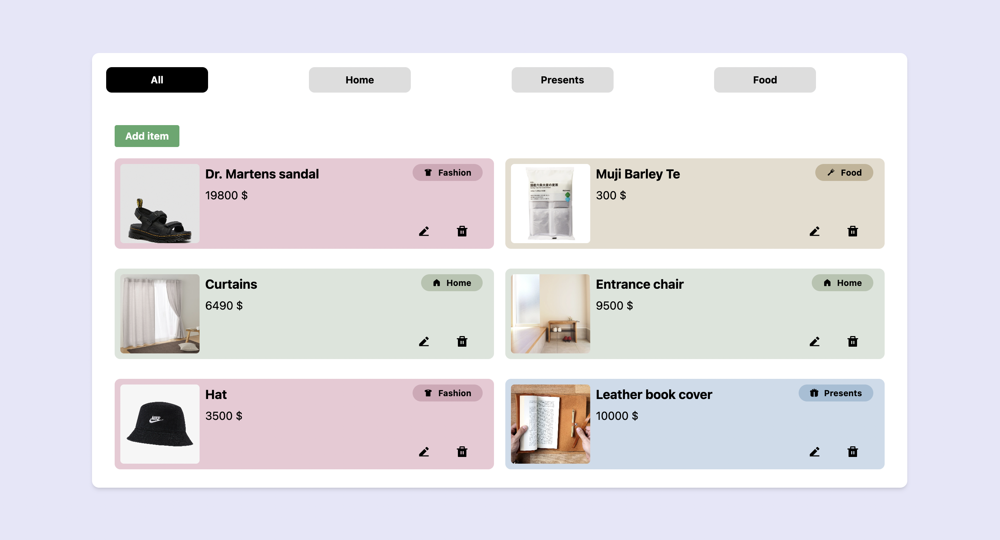

# ABOUT THIS PROJECT

React Wishlist is a simple React app that helps you to keep track of all the items you want. Nowadays there are many online stores, and sometimes it is difficult to remember where you found that special item, so I made this app so I can save them for later 👀🛍

All the items are stored in a Firebase DB.

For the styles I used TailwindCSS.

## Next steps

- Add the option to filter by price and a search bar
- Add more categories

## App's view

## Dependencies installed

<ul>
  <li><a href="">firebase</a></li>
  <li><a href="">react-router-dom</a></li>
  <li><a href="">classnames</a></li>
  <li><a href="">react-helmet</a></li>
  <li><a href="">react-icons</a></li>
</ul>

## Getting Started with Create React App
This project was bootstrapped with [Create React App](https://github.com/facebook/create-react-app).
